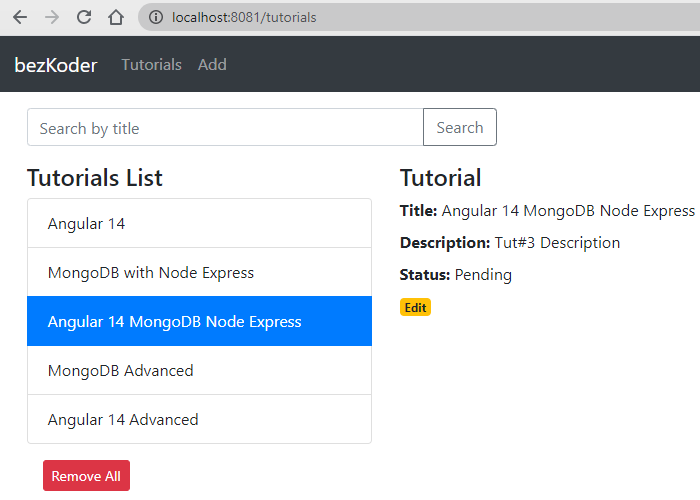

# MEAN stack with Angular 14 CRUD example

In this tutorial, I will show you how to build a full-stack (MEAN stack) Angular 14 + Node.js example with a CRUD Application. The back-end server uses Node.js + Express for REST APIs and connects with MongoDB database, front-end side is an Angular App with HTTPClient.

We will build a full-stack Tutorial Application in that:
- Tutorial has id, title, description, published status.
- User can create, retrieve, update, delete Tutorials.
- There is a search box for finding Tutorials by title.



Tutorial link: 

> [MEAN stack with Angular 14 CRUD example](https://www.bezkoder.com/mean-stack-crud-example-angular-14/)

Or:
> [Angular 14 + Node.js + Express + PostgreSQL example](https://www.bezkoder.com/angular-14-node-js-express-postgresql/)

> [Angular 14 + Node.js Express + MySQL example](https://www.bezkoder.com/angular-14-node-js-express-mysql/)

For more detail, please visit:
> [Angular 14 CRUD Application example with Web API](https://www.bezkoder.com/angular-14-crud-example/)

> [Node.js, Express & MongoDb: Build a CRUD Rest Api example](https://www.bezkoder.com/node-express-mongodb-crud-rest-api/)

> [How to integrate Angular with Node.js Restful Services](https://www.bezkoder.com/integrate-angular-12-node-js/)

More Practice:
> [Deploying/Hosting Node.js app on Heroku with MySQL database](https://www.bezkoder.com/deploy-node-js-app-heroku-cleardb-mysql/)

Pagination:
> [Server side Pagination with Node.js and Angular](https://www.bezkoder.com/server-side-pagination-node-js-angular/)

- File Upload:
> [Angular File upload example with progress bar & Bootstrap](https://www.bezkoder.com/angular-14-file-upload/)

> [Node.js Express File Upload Rest API example](https://www.bezkoder.com/node-js-express-file-upload/)

Security:
> [Angular + Node.js Express: JWT Authentication and Authorization example](https://www.bezkoder.com/node-js-angular-13-jwt-auth/)

Associations:
> [Sequelize Associations: One-to-Many Relationship example](https://www.bezkoder.com/sequelize-associate-one-to-many/)

> [Sequelize Associations: Many-to-Many Relationship example](https://www.bezkoder.com/sequelize-associate-many-to-many/)

Serverless with Firebase:
> [Angular Firebase CRUD with Realtime DataBase | AngularFireDatabase](https://www.bezkoder.com/angular-13-firebase-crud/)

> [Angular Firestore CRUD example with AngularFireStore](https://www.bezkoder.com/angular-13-firestore-crud-angularfirestore/)

> [Angular Firebase Storage: File Upload/Display/Delete example](https://www.bezkoder.com/angular-13-firebase-storage/)

## Project setup

### Node.js Server
```
cd node-js-server
node server.js
```

### Angular Client
```
cd angular-14-client
```
Run `ng serve --port 8081` for a dev server. Navigate to `http://localhost:8081/`.